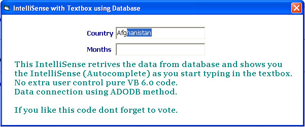



## IntelliSense/Autocomplete with Textbox using Database

### Description

This IntelliSense retrives the data from database and shows you the IntelliSense (Autocomplete) as you start typing in the textbox.

No extra user control pure VB 6.0 code.

Data connection using ADODB method.

If you like this code dont forget to vote.
 
### More Info
 

             |
---                |---
**Submitted On**   |2011-08-05 08:00:02
**By**             |[Ashish Kumbhar](https://github.com/Planet-Source-Code/PSCIndex/blob/master/ByAuthor/ashish-kumbhar.md)
**Level**          |Advanced
**User Rating**    |4.6 (23 globes from 5 users)
**Compatibility**  |VB 6\.0
**Category**       |[Coding Standards](https://github.com/Planet-Source-Code/PSCIndex/blob/master/ByCategory/coding-standards__1-43.md)
**World**          |[Visual Basic](https://github.com/Planet-Source-Code/PSCIndex/blob/master/ByWorld/visual-basic.md)
**Archive File**   |[IntelliSen220892852011\.zip](https://github.com/Planet-Source-Code/ashish-kumbhar-intellisense-autocomplete-with-textbox-using-database__1-74028/archive/master.zip)

